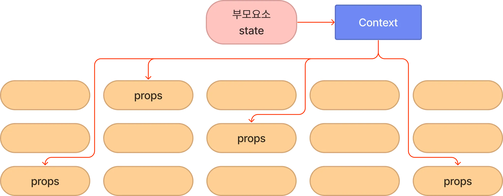

# useContext??
## Context의 정의

: 컴포넌트 간의 데이터(state)를 전달하려면 props를 이용하여 전달해야 했음. props를 통한 전달 방법은, 부모요소에서 자식요소로만 진행되며 부모-자식 컴포넌트의 깊이가 깊어질수록 데이터를 사용하지 않는 컴포넌트라도 자식컴포넌트가 사용한다면 props를 넘겨줘야하는 문제가 있음


비교적 작은 규모의 프로젝트의 경우 데이터를 넘겨줄 때에 간단한 작업으로 효율적으로 가능하나, 규모가 있는 프로젝트일수록 커모넌트의 깊이가 깊어지고 데이터의 전달이 많아지게 됨, props가 필요한 자식 컴포넌트가 아니라도, 그 아래 자식 컴포넌트에게 전달하기 위한 props를 전달해야 하는 불필요하고 반복적인 작업이 이루어지게 됨
예시는 useContext2와 같음


이상과 같은 현상을 props drilling이라고 함, 컨텍스트는 리액트 컴포넌트 트리 안에서 데이터를 공유할 수 있도록 고안된 방법이기 때문에 props drilling을 막을 수 있음

그 예시는 useContext3과 같음



전역적으로 데이터를 관리하고 사용할 수 있는 방법이 있기 때문에, props를 넘겨주는 방식을 절대 상요하지 않고 컨텍스트만 쓰면 되겠다 할 수 있는데, 규모가 작은 프로젝트면 props를 사용하는것이 효율적일수 있으니 둘 중 상황에 맞게 사용하면 됨

## Context 종류

: 리액트에서 공식적으로 Context API를 통해 useContext Hook을 사용하기 전에는 의미없는 props drilling을 피하기 위해 Context API가 아닌 다른 라이브러리를 사용했었음. MobX, xstate, recoil, zustand 등 상태 관리를 위한 여러 라이브러리가 존재하며, Context API 에서 제공하는 기능 외의 기능을 활용해야 하는지 확인하고 효율성을 따져 라이브러리를 선택해야 함

규모가 큰 프로젝트에서 대량의 데이터를 저장하고 싶을때 Context API보다 넓은 범용성을 가진 다른 라이브러리가 효율적으로 쓰임, side effect, memoization, data serialzation 등의 기능을 활용해야 할 때 다른 라이브러리를 선택하는 편

다른 라이브러리 들이 여러 기능과 범용성에서 이점을 갖게 되니 리엑트에서도 공식적으로 React.createContext 와 useContext가 등장, 활발히 사용

# useContext 사용법

기존의 context API를 사용하여 데이터 전달하는 방법 / useContext를 사용하는 방법을 나눠서 설명

## 기존의 context API 사용 사례

: contextAPI는 Context.Provider 와 Context.Consumer를 사용 데이터를 전달하고 싶은 컨텍스트를 Context.Provider로 감싸줌

```jsx
import Customer1 from './Customer1';
import Customer2 from './Customer2';

function App(){
  
  return(
    <MenuContext.Provider
    value={{
      아메리카노:"3500",
      카페라떼:"4000",
      }}
    >
      <Customer1/>
      <Customer2/>
    </MenuContext.Provider>
  );
}

export default App;
```
App.jsx 작성부분 -> MenuContext/Customer1/Customer2가 있어야 한다는것 알 수 있음

```jsx
import { createContext } from "react";
export const MenuContext = createContext(null);
```
Context는 따로 파일을 생성하여 사용하였음, createContext(initialValue)형태로 작성. 단 이 초기값은 Context.Provider를 통해 value 값을 설정하지 않았을 때 작동

```jsx
import { MenuContext } from "./Context";
export default function Customer1(){
  return(
    <MenuContext.Consumer>
      {(price) => <div>1번 고객님은 {price.아메리카노}원을 지불합니다.</div>}
    </MenuContext.Consumer>
  );
}
```
이상의 방법이 기존의 context API사용 방법
## useContext를 사용하는 방법

: useContext를 사용했을 때 이상의 방법과 작성 차이점을 확인합니다.
Customer01.jsx
Customer02.jsx

```jsx
import { useContext } from "react";
import { MenuContext } from "./Context";
export default function Customer01(){
  const price = useContext(MenuContext);
  return <div>1번 고객님은 {price.아메리카노}원을 지불합니다</div>
}
```
useContext를 사용했을 때 Context.Consumer를 사용하지 않았다는데 주목 -> App.jsx에서도 MenuContext.Provider를 사용하지 않음

```jsx
import Customer01 from "./Customer01";
import Customer02 from "./Customer02";

function App(){
  return(
    <>
      <Customer01/>
      <Customer02/>
    </>
  );
}

export default App;
```
MenuContext.Provider의 복잡한 작성예시를 따를 필요 없이, 그냥 fragment를 사용해서 작성할 수 있다는 차이점이 있음

```jsx
// import { createContext } from "react";
// export const MenuContext = createContext(null);

// contextAPI 활용 사례↑↑
// useContext 활용 사례↓↓

import { createContext } from "react";

const Menu= {
  아메리카노:"3500",
  카페라떼:"4000",
}
export default MenuContext = createContext(Menu);
```
경로가 꼬일 수 있어서 한곳에 작성. 작성방법의 차이 확인
App16.jsx 수정

```jsx
import { useState } from "react";
import Customer01 from "./Customer01";
import Customer02 from "./Customer02";
import Store from './Store'
import { OpenContext } from "./Context";

function App(){
  const [isOpen, setIsOpen] = useState(false);
  return(
    <div className="App">
      <OpenContext.Provider value={{ isOpen, setIsOpen }}>
      <Store />
      <Customer01/>
      <Customer02/>
      </OpenContext.Provider>
    </div>
  );
}

export default App;
```
수정버전, Store.jsx를 만들어야 한다는 사실 알 수 있고, 그리고 contextAPI를 사용하여 Provider도 응용했음을 확인할 수 있음.
그리고 useState를 확인했을 때 내부의 argument가 boolean 타입임도 알 수 있음

Store.jsx 생성

가게 열고 닫는 버튼 가지며, useContext를 통해 가져온 setIsOpne으로 버튼 클릭시 isOpen의 값을(상태를) 변경 가능하도록 작성 예정

```jsx
import { useContext } from "react";
import { OpenContext } from "./Context";

export default function Store(){
  const { isOpen, setIsOpen } = useContext(OpenContext);

  const ClickOpen = () => {
    setIsOpen(true);
  };

  const ClickClose = () => {
    setIsOpen(false);
  };

  return(
    <div>
      가게문이 {isOpen ? "열렸습니다" : "닫혔습니다"}
      <br />
      <button onClick={ClickOpen}>가게 문 열기</button>
      <button onClick={ClickClose}>가게 문 닫기</button>
    </div>
  );
}
```
Store.jsx 의 사례

까지 작성 후 main.jsx 수정하면 useContext / contextAPI 활용 작성 사례확인 가능

```jsx
import React from "react";

const AuthContext = React.createContext('');

export default AuthContext;
```
Authentication의 축약어 

# 리액트로 목록 처리

## List로 처리

: 목록 처리를 위해 목록을 조작해야 할 때 자바스크립트의 map() 매서드를 사용

map() 매서드는 원래 배열의 각 요소에 함수를 호출한 결과를 포함하는 '새 배열'을 만듬

```jsx
const arr = [1,2,3,4];
const resArr = arr.map(x => x*2);
```

MyList.jsx 생성

```jsx
function MyList(){
  const data = [1,2,3,4,5];
  return(
    <>
      <ul>
        {
          data.map(number =>
            <li>ListItem {number}</li>
          )
        }
      </ul>
    </>
  );
}

export default MyList;
```
이상의 코드 작성시 아래와 같은 오류 발생


Warning: Each child in a list should have a unique "key" prop.

Check the render method of `MyList`. See https://reactjs.org/link/warning-keys for more information.
    at li
    at MyList

- 리액트의 목록 항목에는 업데이트, 추가, 삭제 되었는지를 감지하는데 이용되는 고유 키(unique key)가 필요함. 그래서 map() 메서드의 두번째 argument로 index개념이 있는데 , 이는 해당 경고를 처리하는 데 사용

수정본
```jsx
import './App.css'

function MyList(){
  const data = [1,2,3,4,5];
  return(
    <>
      <ul>
        {
          data.map((number, index) =>
            <li key={index}>ListItem {number}</li>
          )
        }
      </ul>
    </>
  );
}

export default MyList;
```
-map()메서드의 두번째 argument인 index 개념과, 이를 사용하는 <li key={index}>가 리액트 상에서는 필수적이라는 점에 주목

* 목록 순서를 바꾸거나 목록 항목을 추가, 삭제할 경우 버그가 발생할 수 있으므로 index를 이용하는것은 권장하지 않음.(고유한 key 값 설정 ex> id, PW 등) 대신 데이터의 고유 키가 존재한다면 그것을 사용하는것이 바람직함

## Table 로 처리

: 데이터가 객체의 배열이라면 테이블 형식으로 작성하는편이 더 나음, 목록을 처리할 때와 거의 동일하지만 tr및 td와 같은 부분을 신경쓸 필요가 있음(html태그 기준). 리액트에서 요구하는 추가적인 정보도 기입해야 함

```jsx
function MyTable(){

  const data = [
    {id: 1, brand:'Ford', model:'Mustang'},
    {id: 2, brand:'VW', model:'Beetle'},
    {id: 3, brand:'Tesla', model:'Model S'},
  ];


  return(
    <table>
      <tbody>
        {
          data.map(item =>
            <tr key={item.id}>
              <td>{item.brand}</td><td>{item.model}</td>
            </tr>
          )
        }
      </tbody>
    </table>
  );
}

export default MyTable
``` 

* React 목록처리 방식에서 # 1 List/ #2 Table 형태로 다루는 방법을 학습 -> .map()메서드가 중요했음

# 리액트로 이벤트 처리

: 리액트의 이벤트 처리는 DOM요소 이벤트 처리와 유사. HTML이벤트 처리와 다른점은 이벤트를 지정할 때 리액트에서는 카멜케이스를 사용한다는 점

- calmel case : 첫글자는 소문자 두번째 단어의 첫번째는 대문자 -> ex) myTable

예시에서 컴포넌트 코드는 버튼에 이벤트 리스너를 추가하고 버튼을 눌렀을 때 경고 메시지 표시하는 형태로 작성 예정

```jsx
function MyComponent(){
  
  const handleCheck = () => {
    alert('버튼누름');
  }
  
  return(
  <>
    <button onClcik={handleCheck}>클릭하시오</button>
  </>
  );
}
export default MyComponent
```
수업했던 카운터 예제에서 처럼 함수를 호출하는 대신 함수 이름을 이벤트 핸들러에 연결

```jsx
// 맞는 예
<button onClcik={handleCheck()}>클릭하시오</button>
// 틀린 예
<button onClcik={handleCheck}>클릭하시오</button>
```

MyForm.jsx 생성

```jsx
export default function MyForm(){
  // 폼이 제출될 때 호출
  const handleSubmit = (event) => {
    event.preventDefault();
    alert('폼 제출')
  }
  return(
    <form onSubmit={handleSubmit}>
      <input type="submit" value = "Submit" />
    </form>
  );
}
```
- 리액트에서는 기본 동작을 방지하기 위해 event 핸들러에서 false를 반환하는 방법을 쓸 수 없다. 대신 이벤트 객체의 preventDefault()메서드를 호출 해야한다.

- 이상의 예제는 form요소를 이용하여 폼 제출을 방지하는 방법을 보여주는것

- 제출 버튼을 눌렀을 때 알람이 표시되고 양식이 제출되지는 않음

# 리액트로 폼 처리

: 리액트에서는 폼 처리 방식이 HTML과 다름. HTML의 경우 from이 제출되면 다음 페이지로 이동하는데, 리액트에서는 제출 후 폼 데이터에 접근할 수 있는 JS함수를 호출하고 다음 페이지로 이동을 방지하고 싶은 경우가 많음(SPA이기 때문) preventDefault() 를 이용하는 방식은 리액트로 이벤트 처리 부분에서 다룸

- 하나의 입력 필드와 제출버튼이 있는 최소한의 폼을 만든 뒤 , 입력한 필드의 값을 가지고 오기 위해 onChange 이벤트 핸들러 적용하고, useState 훅을 이용 text 상태 변수도 생성, 입력 필드의 값이 변경되면 새 값이 상태에 저장될 것

```jsx
import { useState } from "react";

export default function MyForm() {
  const[ text, setText ]= useState(null);

  const handleChange = (event) =>{
    setText(event.targer.value);
  }

  const handleSubmit = (event) => {
    alert(`${text}라고 입력함.`)
    // console.log(`${text}`)
    event.preventDefault();
  }

  return(
    <form onSubmit={handleSubmit}>
      <input type="text" onChange={handleChange} value={text} />
      <input type="submit" value="제출" />
    </form>
  );
} 
```
이상의 코드를 남겨둔 상태에서, 사실 handleChange의 경우 대표적으로 자주 사용하는것이긴 함, 간단한 이벤트 핸들러 함수인 경우 onChange내에서 인라인으로 작성하는 경우가 많음

이상의 MyForm2.jsx의 MyForm에서 handleChange를 삭제하고, onChange내에 인라인 형태로 다시 작성하기

동일한 기능으로 작동해야함

- 그런데 일반적으로 폼에는 입력 필드가 복수인 경우가 많음. 객체 상태를 이용해서 이를 처리하도록 해볼 예정. 즉, firstName/ lastName / email 과 같은 것을 받아서 한방에 객체 1번에 저장한다든지 하는 방식으로 처리 예정.

- 여러 input 필드를 처리할 때 input 필드 수 만큼 변경 핸들러를 처리할 수 있기는 함(MyForm3에서 처럼 user.firstName/user.lastName 같이 하나하나 만드는거 가능) 하지만 이상의 경우 상용구 코드가 많이 생성되고 범용성이 없기 때문에 지양하는것이 좋음. 해당 문제를 해결하기 위해서는 input 필드에 name 속성을 추가하는 방식을 들 수 있음. onChange 핸들러에서 트리거하는 input필드를 식별하여 해당 부분에 값을 대입하는 형태로 상태 업데이트 가능

```jsx
<input type="text" name="lastName" onChange={handleChange} value={user.lastname} />
const handleChange = (event) =>{
  setUser({... user, [event.target.name]:
    event.target.value});
}
```