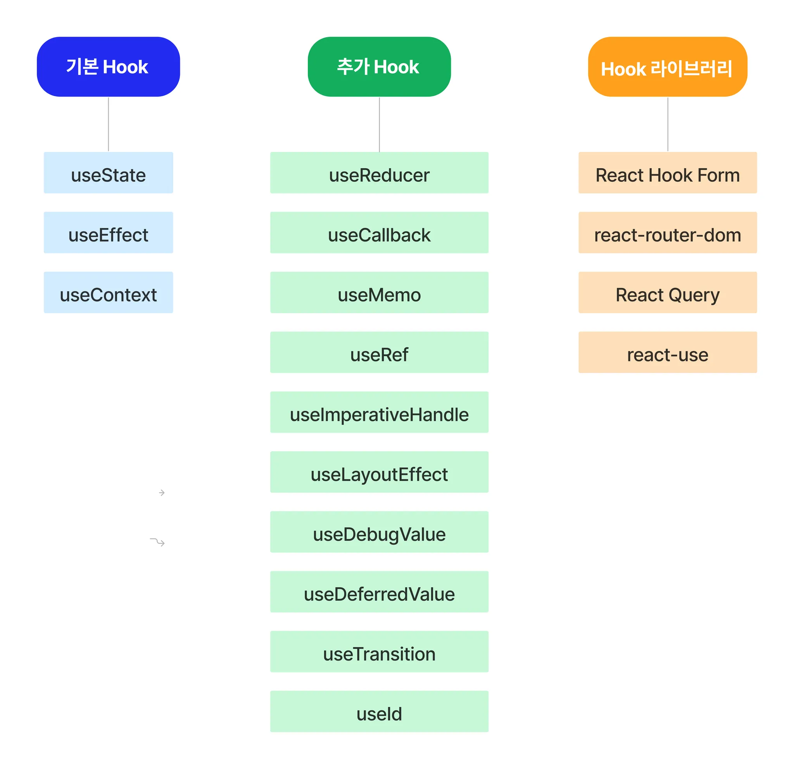

# 오류 수정

1. npm install uuid
2. Main 컴포넌트에 Button 컴포넌트 안에 
```jsx
<main>
      <Button>레드벨벳 노래찾기</Button>
      <Button>남자 아티스트 노래찾기</Button>
      <Button>여자 아티스트 노래찾기</Button>
      <KPopList/>
    </main>
```
3. context.jsx 
```jsx
  return(
    <KPopContext.Provider value={{data, playList, setPlayList}}>
      {children}
    </KPopContext.Provider>
  );
```

# Hook

## 정의

: Hook 은 함수 컴포넌트에서 상태 관리와 생명주기 기능을 연동할 수 있게 해주는 함수

함수 컴포넌트는 상태를 가질 수 없고, 메서드를 사용해 생명주기를 관리하는 것도 불가함
기존에는 코드의 복잡성과 낮은 재사용성의 문제에도 불구하고 클래스 컴포넌트를 사용해야만 했음, 이후에 Hook이 등장하고, 효율적인 상태 관리 및 생명주기 기능을 사용할 수 있게 됨



### 기본 Hook vs. 추가 Hook

- 기본 Hook은 상태 관리와 생명주기 기능을 위해 가장많이 사용됨
- 추가 Hook은 기본 Hook을 변경하거나 특정한 경우에 필요에 따라 사용
- Hook라이브러리를 참고하고, 미리 유용한 기능을 파악하면 Custom Hook의 필요성 여부를 따질 수 있고, Custom Hook 제작시 추가 가능

### Hook의 사용 이유
: 이상의 필기에서 함수 컴포넌트에서는 상태 관리 및 생명주기 메서드 사용이 불가하였기에 로직의 재사용 및 구조 파악이 어렵고 코드가 복잡한 클래스 컴포넌트의 사용이 강제됨

```jsx
// 클래스 컴포넌트 예시
class Example extends React.component{
  constructor(){
    super();
    this.state = {title: "example"};
  }
  render(){
    return <p>hello, {this.state.title}</p>
  }
}
```
클래스 컴포넌트는 render() 메서드를 반드시 포함해야 하고, render() 메서드 내부에 렌더링 하고 싶은 JSX 코드를 작성하는 구조였음, 또한 props를 조회하거나 상태를 업데이트 하기 위해서 this키워드를 활용해 this.props / this.setstate를 사용 해야했음

하지만 이후 함수 컴포넌트에서 상태관리 및 생명주기 이벤트 상요 가능해 졌는데 예시는 다음과 같음

```jsx
function Example(){
  let [title, setTitle] = useState('example')

  return <p>hello, {this.state.title}</p>
}
```

### Hook 장점

1. 컴포넌트 간 상태 로직을 재사용 가능
2. 구조 이해가 클래스 컴포넌트에 비해 간단
3. 클래스 컴포넌트 없이 함수형 컴포넌트에서 사용 가능

#### 상태 관련 로직 재사용 사용 예시
프로그램 작성시 중복코드를 쉽게 만나게 될 수 있음, 이때 중복된 코드로 인한 불필요한 리소스를 줄이고자 상황에 따라 코드를 재사용함

기존의 클래스 컴포넌트를 기준으로 했을 때 Render props / 고차 컴포넌트 (HOC ,Higher Order Component)와 같은 재사용 패턴 사용해야 했음

예시
```jsx
// 고자 컴포넌트 통한 재사용
function withLogin(WrapperComponent){
  return class extends React.Component{
    constructor(){
      state={
        user: []
      }
    }
    componentDidMount(){

    }
    render(){
      return <WrapperComponent 
              {...this.state}
              {...this.props}
        />
    }
  }
}
// 컴포넌트 재사용
function LoginPage({user}){

}
export default withLogin(LoginPage); // 고차 컴포넌트로 감싸주기

```
와 같은 과정을 거침 , 그런데 Hook의 등장이후 , Custom Hook을 통해 컴포넌트 간 상태를 저장하고 공유할 수 있게 되었음. 즉, 고차 컴포넌트 같은 패턴을 사용하지 않고도 Hook으로 컴포넌트 재사용을 할 수 있게 되었음, 

예시
```jsx
//Custom Hook 컴포넌트 재사용 예시

function useLogin(){
  const [user, setUser] = useState([]);

  useEffect(() => {

  })
  return[user];
}
//컴포넌트 재사용
function LoginPage(){
  const [user] = useLogin();
  //useLogin 컴포넌트를 재 사용해서 원하는 형태로  return을 재구현 한 사레

  return (
    <>
      {user.map(({num, email, name}, idx) => {
        <div key={num}>
          <p>{email}</p>
          <strong>{name}</strong>
        </div>
      })}
    </>
  )
}
```

#### props drilling vs. state


state를 사용시에 데이터가 필요한 컴포넌트에 바로 사용이 가능하다는 점에서도 상태를 이용한 Hook의 장점이 많이 부각되었음

여태까지 수업을 통해 useState / useEffect / useContext를 작성했음
그래서 금일 추가 Hook에 해당하는 useReducer에 대한 개념을 학습\

# useReducer

: React에서 상태를 관리하는 '내장Hook'  으로 useState보다 복잡한 로직을 다룰 때 유용한 기능
특히 여러개의 관련 상태를 다루거나, 상태변경 로직이 복잡한 경우에 더 적합함

## useReducer 사용 이유 
- 여러개의 상태가 서로 관련이 있거나 복잡한 업데이트 로직의 필요시
- 액션 기반 업데이트 : 상태 업데이트를 '액션'을 통해 수행, 명확하고 예측 가능한 방식으로 상태 변경을 관리 가능
- 코드 가독성 향상  : 상태 변경 로직을 reducer 함수 안에 모아두기 때문에 컴포넌트 내부 코드가 깔끔해짐
- Redux 와 유사 패턴 : useReducer는 Redux 의 reducer와 유사하기 때문에 Redux 개념 배우기 이전에 연습에도 적절함

## useReducer 기본 구조
```jsx
const [state, dispatch] = useReducer(reducer, initialState);
```

- reducer : 상태를 업데이트하는 함수(순수 함수, 이하의 링크 참조) https://ko.redux.js.org/usage/structuring-reducers/prerequisite-concepts/
- initalState : 초기 상태 값
- state : 현재 상태 값
- dispatch

```jsx

```
1. initialState : count: 0  으로 초기상태 설정(자료형을 고려)
2. reducer 함수 : increment / decrement 액션에 따라 count값 변경
3. useReducer를 사용해 state와 dispatch가져옴
4. dispatch({type:"increment"})


해당 예시의 의의는 useReducer를 사용하는 방법에 해당
이상의 코드의 경우 useState를 통해서 충분히 쉽게 가져갈 수 있는데, reducer함수 부분을 보시면 알다시피, 내부에 복잡한 로직이 들어가있더라도 useReducer와 함께 모영있는 형태로 언제나 불러낼 수 있다는 점이 간단한 로직만 포함될 수있는 useState에 비해 강점이 있다 알아두면 됨

* count가 음수가 되는 상황도 건들이지 않음

### useState vs. useReducer

useState
- 사용 목적
- 상태 변경 방식
- 여러 상태 유지
- 상태 변경 로직 위치: 컴포넌트 내부엣서 관리

usereducer
- 복잡한 상태 관리
- 상태 변경 방식 : dispatch를 통해 변경
- 여러 상태 관리
- 상태 변경 로직 유지
```jsx
const[ conut, setCount] = useStaet(0);
<button onClick>{()onLck}

```
이상의 문제는 reducer 함수 파트 작성안했음


이상의 그림은 useState를 예시화 함. 100 원을 입금할 것이라는 요구사항을 가진 사용자와 사용자의 계좌인 state가 존재하는데 사용자는 입금을 하기 위해서 직접 계좌에 입금내역을 저장해얗마 


이상의 그림은 useReducer의 흐름을 은행으로 표시한 것, 사용자는 임금하겠다는 요구사항 지니고 있으며 useState와 달리 창구 직원 은행 시스템 이라는  중간지 존재 이때 사용자는 입금 이라는 

즉 요구사항 : action
창구 직원 : dispatch
은행 시스템 : reducer
로 비유한 것으로 useReducer를 사용하게 될겨우


복잡하다의 기준에 관한 예시

객체나 배열같이 여러개의 하위 값을 포함하는 복잡한 state를 가지거나 혹은 확장성이 있을 때에는 useReducer를 사용할 때 코드가 간결해지고 유지보수가 편함


### useState를 통한 복수 함수 처리 예시

```jsx
```

강사 염려 사항 : '이정도면 할만하다.' 를 의도한게 아님

```jsx

```

### reducer란??

: 현재 state 와 action 값을 전달받아 새로운  state 로 반환하는 함수

```jsx
// 현재 state, action 을 매개변수로 받음
function Reducer(state, action)=> {
  return // 구현부
}
// 혹은 화살표 함수 이용해
const Reducer = (state, action)=> {
  return // 구현부
}
```

#### action 과 type
- action 은 현재 state의 업데이트(상태 변경)를 위해 필요한 정보를 담은 값으로 보통은 객체의 형태를 띔 하지만 action 의 값은 string 이거나 number라도 상관없음

reducer의 로직은 action 이 새로운 state를 계산하는데 쓰이는지 확인하기 위해 action.type을 체크함, 이때 action 들이 분명한 의미를 가지고 유용한 정보를 주도록 설명하는 방식의 type필드를 작성해야 함, 근데 안쓸때도 있음

```jsx
switch(action.type){
  //Reducer 함수로 전달된 action 객체 값이
  //{type: "LOGIN_SUCCESS'}라면 이하의 문구가 실행되도록 하는예제
  case "LOGIN_SUCCESS" :
    return{
      ...state,
      user:action.payload,
      isLogin: true,
      message: "로그인성공"
    }
}
```
예를 들어 이상의 코드는 switch 코드를 사용하여  action 객체의 type 필드에 매핑되어있는 값, 즉 LOGIN_SUCCESS case에 따라 state를 업데이트 함(LOGIN_FAILED도 가능)

### reducer 함수의 조석 - 순수 함수
: reducer를 순수함수로 작성하는 이유는 ㄴ갲발자작  예상한대로 동작하는것이 보장되도록 하는 것에 목적이 있음

-> reducer함수 내에서 reducer 함수 스코프 바깥의 변수를 수정하거나 사용해서는 안된다
->함수 내에서 선언된 변수는 그 내부에서만 사용되어야 하고, 바깥의 변수의 가ㅡㅄ 대입 및 참조는 순수 함수가 아니다, 라고 해석 가능

* 순수함수 (pre function )vs. 비순수 함수(impure function)

순수 함수의 의미 : 동일한 매개변수가 주어지면 항상 동일한 결과를 반환하는ㄴ 함수.
- 순수함수를 사용하면 부수효과 가 발생하는것을 방지할 수 있음

```jsx
function pureAdd(num1,num2){
  return num1+num2;
}
console.log(pureAdd(1,2))
console.log(pureAdd(1,2))
```
외부 환경에 의한 영향을 받지 않고 주어진 argument가 같을때 같은 결과 반환

```jsx
let sideNumber = 10;

function impureAdd(num1,num2){
  return num1+num2+sideNumber;
}
console.log(inpureAdd(1,2))//13
sideNumber = 20;
console.log(inpureAdd(1,2))//23
```
inpureAdd 함수는 스코프 외부에서 선언된 sideNumber변수가 impureAdd함수에서 다뤄지고 있고 주어진  argument가 같아도 다른 결과를 반환하므로 비순수 함수에 해당

### reducer 함수의 조건 - 상태 변이(state mutation) 지양

state는 불변의 데이터 구조를 가져야 함. 하지만 빈번하게 state의 원본을 수정하거나 추가, 혹은 덮어쓰는 방식을 사용할 경우 state 변이가 발생하게 됨

문제 예시
기존 state를 사용하던 다른 컴포넌트에서 에러를 발생시겨 리렌더링시에 예기치 않은 문제가 발생할 수 있음

디버깅을 시도하더라도 state 가 어디서 변경되었는지 알기가 어려움

이상의 문제를 해결하기 위해 깊은 복사를 사용하여 업데이트한 state를 반환하여 기존 state를 대체함

deep copy(깊은복사) vs. shallow copy(얕은복사)의 개념

* 깊은 복사 : 데이터 자체를 복사하여 '다른' 주소값을 가지는 새로운 변수(혹은 객체)로 생성하는 것을 의미

상태 변이의 예시 / 깊은복사 예시
```jsx
function Reducer(state, action) {
  switch(action.type){
    case : "LOGIN_SUCCESS"
    //상태변이 사례가 여기 나옴 -> 지양해야함
    state[user] = action.payload;
    state[isLogin] = true;
    state[message] = "로그인 성공"
    return state;
  }
}
```
```jsx
switch(action.type){
  case "LOGIN_SUCCESS" :
    // 깊은 복사를 통해 새로운 객체를 반환하는 사례
    return{
      ...state,
      user:action.payload,
      isLogin: true,
      message: "로그인성공"
    }
}
```

### useReducer 중급 예제
src -> components -> LoginForm.jsx
    -> context -> Context.jsx
    -> reducer -> Reducer.jsx
    App.jsx는 <></>만 남긴뒤 초기화

    20250319 -> useState / useReducer 비교 대조 부분을 페이지 수준에서 다룰예정

    조별과제 3월 25일 부터 조편성 및 회의
    개별과제 3월25일 부터 과제 정한뒤 제출해가며 사이트 만드는 과정